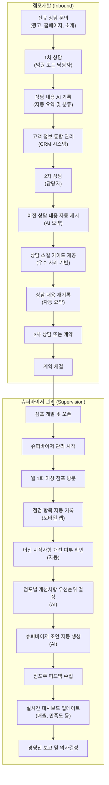
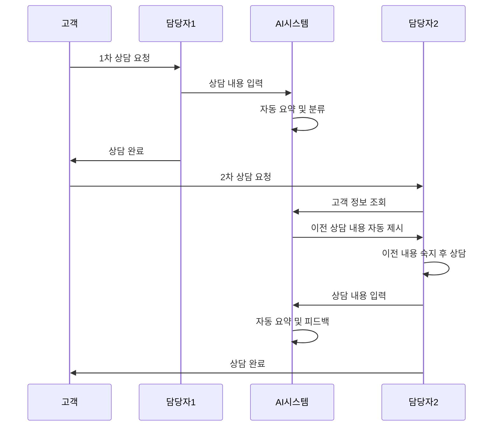
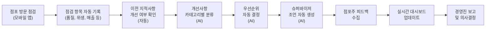
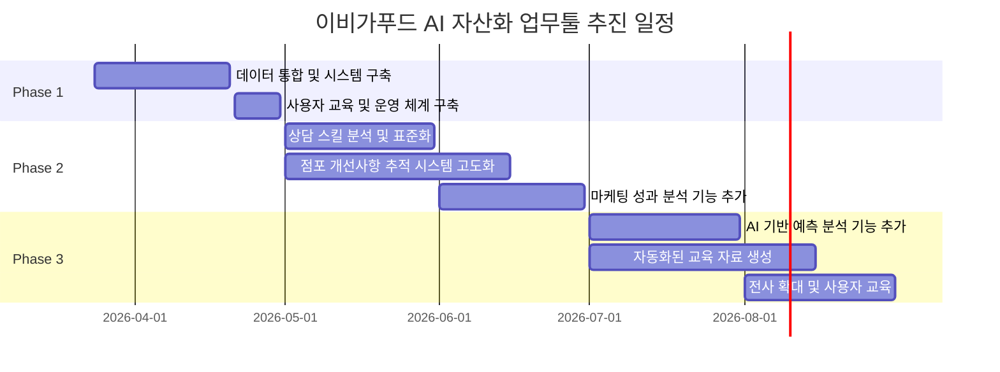
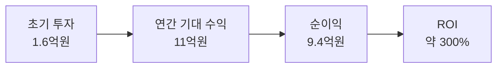
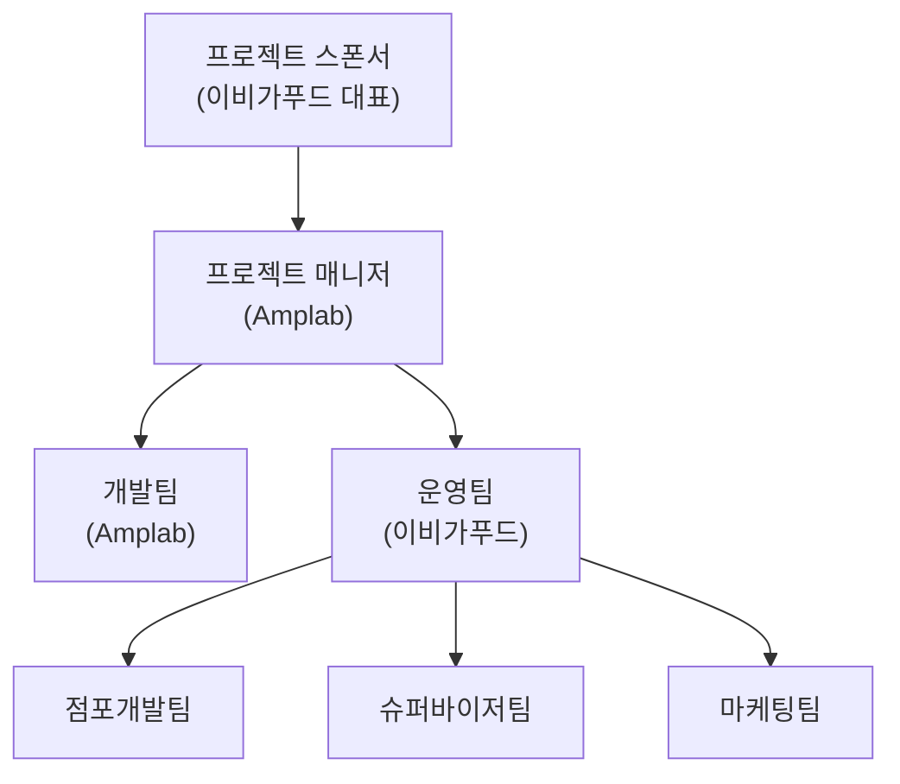
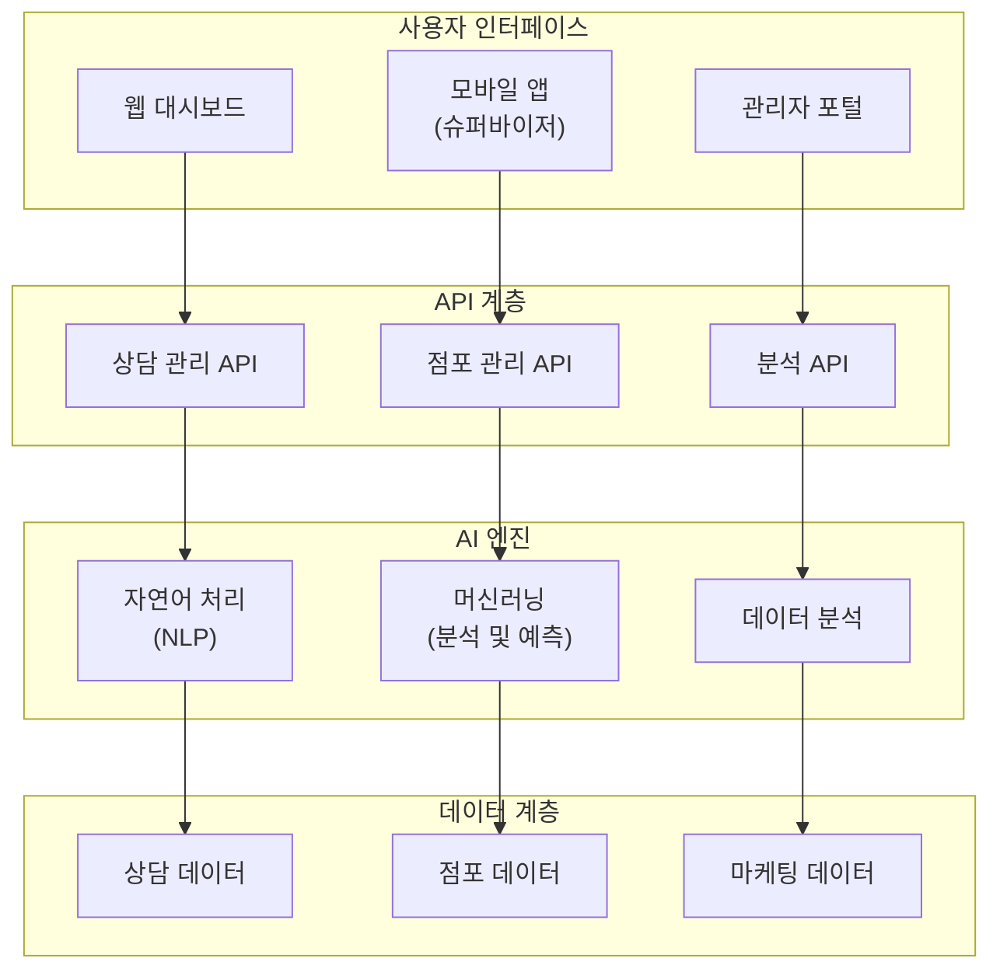

# 이비가푸드 AI 자산화 업무툴 제안서

## 1. 배경 및 목적

### 1.1 현재 상황

이비가푸드는 중식 프랜차이즈 시장에서 신규 창업 상위 브랜드로 주목받고 있으나, 급속한 성장 과정에서 다음과 같은 구조적 과제에 직면하고 있습니다:

**점포개발 상담 프로세스의 문제점:**
- 여러 상담자가 동일 고객과 반복 상담할 때 이전 상담 내용이 누락되어 고객 피로도 증가
- 상담 이력이 엑셀 수기 기록으로 관리되어 검색 및 활용이 어려움
- 상담 담당자별 역량 편차로 인한 전환율 불균형
- 우수 상담 사례 벤치마킹 및 표준화 불가능

**슈퍼바이저 점포 관리의 비효율성:**
- 상담일지가 단순 수행 기록에 그쳐 개선사항 추적 및 효과 측정 불가
- 점포별 개선 과제의 우선순위 결정 어려움
- 슈퍼바이저 4명의 역량 편차로 인한 관리 수준 불균형
- 점포 위기 상황 조기 발견 및 선제적 대응 체계 부재

### 1.2 프로젝트 목표

본 프로젝트는 **AI 기반 자동화 시스템**을 통해 이비가푸드의 핵심 업무 프로세스를 혁신하여 다음을 실현합니다:

- **상담 효율화**: 상담 이력 통합 관리로 중복 상담 제거 및 전환율 향상
- **관리 자동화**: 점포별 개선사항 자동 분류·추적으로 체계적 관리 실현
- **데이터 기반 경영**: 실시간 대시보드를 통한 의사결정 고도화
- **가맹점 만족도 향상**: 밀착 관리로 폐점률 감소 및 브랜드 신뢰도 강화

---

## 2. 현황 분석

### 2.1 시장 및 산업 동향

**프랜차이즈 산업의 구조적 위기:**

국내 외식 프랜차이즈 산업은 2024년 기준 가맹본부 8,802개, 브랜드 1만 2,377개로 2019년 통계 시작 이후 처음 감소했습니다. 고물가·고금리로 인한 내수경기 악화와 자영업 경영 여건 악화가 주요 원인이며, 특히 **한식 폐점률이 19%로 가장 높음**을 보이고 있습니다.

더욱 심각한 것은 2024년 외식업 프랜차이즈 정보공개서 등록취소가 **1,313건으로 4년 전 대비 41.3% 증가**했다는 점입니다. 이는 프랜차이즈 산업 전반의 경영 악화가 심각한 상황임을 의미합니다.

**시장 기회: 운영 효율성 중심으로의 전환:**

2026년 글로벌 프랜차이즈 시장은 1,603.5억 달러로 평가되며, 2035년까지 연 9.73% 성장률로 3,698.4억 달러에 도달할 것으로 예상됩니다. 특히 2026년 창업시장은 **'양보다 질의 시대'로 전환**되고 있으며, 저가 커피, 저가 치킨 등 적은 투자비 모델이 증가하고 있습니다.

**매장 소형화(10평 내외)와 고회전율 중심 모델이 새로운 표준**이 되면서, 운영 효율과 수익성이 규모 확대보다 중요해졌습니다.

**성공 사례: 밀착 관리의 중요성:**

교촌치킨(0.2%), 배스킨라빈스(0.76%)는 업계 평균 대비 현저히 낮은 폐점률을 유지하고 있습니다. 높은 폐점률은 빠른 확장에 집중하면서 상권 보호와 수익성 검토 부족, 가맹점 관리 소홀이 원인이며, **가맹점주 수익 보장과 밀착 관리가 성공의 핵심**입니다.

### 2.2 경쟁 환경 분석

**중식 프랜차이즈 시장 현황:**

중식 프랜차이즈 신규 창업 상위 브랜드로는 엄맛탕, 라화쿵부, 최쉐프의동파육, 홍콩반점0410, 이비가짬뽕, 착한쭝식, 홍짜장, 도쿄짬뽕0820 등이 있으며, **이비가짬뽕은 신규 창업 상위 브랜드로 시장에서 주목받는 경쟁사 중 하나**입니다.

**경쟁사 사례:**

| 경쟁사 | 강점 | 약점 |
|--------|------|------|
| **홍콩반점** | 브랜드 인지도, 오래된 운영 노하우 | 상담 직원의 전문성 부족, 불친절 평가 |
| **도야짬뽕** | 가맹비 면제, 인테리어 자체공사 허용 | 제품 품질 편차, 맛의 일관성 부족 |
| **이비가짬뽕** | 신뢰 기반 상담, 밀착 관리 가능성 | 체계적 관리 시스템 부재 |

### 2.3 고객사 니즈 분석

**3차 미팅 기록 분석:**

이비가푸드 대표는 다음과 같은 핵심 니즈를 제시했습니다:

1. **신뢰 기반 상담 프로세스 구축**
   - "신뢰가 구축되는 게 가장 중요하다"
   - 상담 담당자의 일관된 메시지 전달 필수
   - 고객의 우려사항에 대한 신뢰 기반 대응

2. **슈퍼바이저 관리 시스템 고도화**
   - 점포별 개선사항 카테고리별 자동 분류 및 추적
   - 한눈에 보는 대시보드로 우선순위 관리
   - 점검 주기 자동 제시로 체계적 관리

3. **인력 역량 개발 지원**
   - 체계적인 교육 프로그램 필수
   - 성과 측정 기준 명확화
   - 우수 사례 공유 및 벤치마킹

4. **데이터 기반 의사결정 체계 구축**
   - 상담 추이 분석
   - 채널별 마케팅 효과 측정
   - 점포별 매출 추이 분석

---

## 3. 제안 내용

### 3.1 솔루션 개요

**이비가푸드 AI 자산화 업무툴**은 프랜차이즈 본사의 핵심 업무인 **점포개발 상담 관리**와 **슈퍼바이저 점포 관리**를 AI 기반으로 자동화하는 통합 플랫폼입니다.

**핵심 기능:**

| 영역 | 기능 | 효과 |
|------|------|------|
| **상담 이력 관리** | 모든 상담 내용 자동 기록 및 AI 요약 | 고객 피로도 감소, 상담 시간 단축 |
| **상담 스킬 표준화** | 우수 사례 자동 분석 및 패턴 추출 | 상담 품질 향상, 전환율 증대 |
| **점포 점검 자동화** | 점검 항목 자동 기록 및 개선사항 추적 | 관리 효율성 향상, 점포 건강도 개선 |
| **실시간 대시보드** | 점포별 성과 지표 실시간 모니터링 | 조기 경보, 선제적 대응 |
| **데이터 분석** | 상담, 마케팅, 점포 관리 데이터 통합 분석 | 데이터 기반 의사결정 |

### 3.2 핵심 전략 및 접근 방법

#### **전략 1: 상담 이력 통합 관리 시스템**

**현황:**
- 2026년 1월~3월 30건 이상의 신규 상담 접수
- 상담 담당자 5명 이상 (김승환, 이용준, 김충일, 전종석, 감숭환 등)
- 다단계 상담 진행 (평균 2~3차, 최대 8차)
- 상담 내용이 엑셀 수기 기록으로 관리

**문제점:**
- 여러 담당자가 같은 고객을 상담할 때 이전 내용 누락
- 상담 내용 검색 및 활용 어려움
- 고객 피로도 증가 (1차, 2차, 3차 상담 반복)

**해결 방안:**

**구체적 실행:**

1. **상담 기록 표준화**
   - 상담 일시, 상담자, 고객 정보, 상담 내용, 결과, 다음 조치 사항 자동 기록
   - 음성 녹음 기반 AI 자동 요약 (선택사항)
   - 상담 내용 카테고리별 자동 분류 (지역, 예산, 관심사 등)

2. **상담 이력 조회 및 활용**
   - 고객별 상담 이력 한눈에 파악
   - 다음 상담자가 이전 내용 자동 제시
   - 빠트린 내용 자동 추적 (예: 상권 분석 미실시, 비용 설명 미완료 등)

3. **상담 스킬 가이드 제공**
   - 우수 상담 사례 자동 분석 (전환율 높은 상담)
   - 상담 체크리스트 자동 생성
   - 상담 내용 AI 피드백 (긍정적 표현, 고객 우려사항 대응 등)

#### **전략 2: 슈퍼바이저 점포 관리 시스템**

**현황:**
- 슈퍼바이저 4명 (부산 포함)
- 1명당 약 30~40개 점포 담당
- 월 1회 이상 점포 방문 점검
- 점검 항목: 품질, 위생, 매출, 직원 구성, 상권 변화 등

**문제점:**
- 상담일지가 단순 수행 기록에 그쳐 개선사항 추적 불가
- 점포별 개선 과제의 우선순위 결정 어려움
- 슈퍼바이저 역량 편차로 인한 관리 수준 불균형
- 점포 위기 상황 조기 발견 및 대응 체계 부재

**해결 방안:**

**구체적 실행:**

1. **점포 점검 자동화**
   - 모바일 앱을 통한 점검 항목 자동 기록
   - 이전 방문 시 지적사항 개선 여부 자동 확인
   - 점포별 개선 이력 시각화

2. **개선사항 추적 시스템**
   - 점검 결과로부터 개선 과제 자동 생성
   - 카테고리별 분류 (품질, 위생, 매출, 인력, 상권 등)
   - 우선순위 자동 결정 (심각도, 영향도 기반)
   - 완료 예정일 자동 제시

3. **슈퍼바이저 역량 표준화**
   - 점포 관리 매뉴얼 자동 생성
   - 점포별 맞춤형 조언 AI 제시
   - 우수 사례 자동 공유 (다른 점포의 성공 사례)
   - 슈퍼바이저별 성과 측정 및 피드백

#### **전략 3: 마케팅 성과 측정 및 최적화**

**현황:**
- 마케팅팀 4명 (팀장 1명, 직원 3명)
- 광고 채널: 인스타그램, 페이스북, 네이버 GFS 등
- 월 광고비 투자 진행 중

**문제점:**
- 채널별 성과 측정 미흡
- 광고 효율성 분석 불가
- 광고비 최적화 어려움

**해결 방안:**

1. **채널별 성과 분석**
   - 광고 채널별 유입 고객 추적
   - 채널별 전환율 자동 계산
   - ROI 기반 광고비 최적화

2. **고객 특성 분석**
   - 지역별, 연령별, 관심사별 고객 세분화
   - 채널별 고객 특성 파악
   - 맞춤형 마케팅 메시지 AI 생성

### 3.3 구체적 실행 방안

#### **Phase 1: 기초 구축 (3월~4월)**

**1단계: 데이터 통합 및 시스템 구축**

- **상담 이력 데이터 마이그레이션**
  - 기존 엑셀 상담일지 → AI 시스템으로 이관
  - 데이터 정제 및 표준화
  - 고객 정보 통합 관리

- **슈퍼바이저 점검 데이터 표준화**
  - 점검 항목 표준화 (품질, 위생, 매출, 인력, 상권)
  - 기존 점검 기록 → AI 시스템으로 이관
  - 점포별 개선 이력 정리

- **기본 대시보드 구축**
  - 경영진 대시보드 (전사 지표 요약)
  - 점포개발팀 대시보드 (상담 현황, 전환율)
  - 슈퍼바이저 대시보드 (점포별 건강도, 개선 과제)

**2단계: 사용자 교육 및 운영 체계 구축**

- 본사 직원 대상 시스템 활용 교육
- 운영 규칙 및 프로세스 정의
- 초기 운영 지원 및 피드백 수집

#### **Phase 2: 기능 고도화 (5월~6월)**

**1단계: 상담 스킬 분석 및 표준화**

- 우수 상담 사례 자동 분석
- 상담 체크리스트 자동 생성
- 상담 내용 AI 피드백 제공

**2단계: 점포 개선사항 추적 시스템 고도화**

- 개선 과제 자동 생성 및 우선순위 결정
- 점포별 개선 이력 시각화
- 슈퍼바이저 조언 자동 생성

**3단계: 마케팅 성과 분석 기능 추가**

- 채널별 성과 분석 자동화
- 고객 특성 분석 및 세분화
- 맞춤형 마케팅 메시지 AI 생성

#### **Phase 3: 최적화 및 확대 (7월~8월)**

**1단계: AI 기반 예측 분석 기능 추가**

- 점포 매출 추이 예측
- 폐점 위험 신호 조기 발견
- 상담 전환율 예측

**2단계: 자동화된 교육 자료 생성**

- 슈퍼바이저 교육 자료 자동 생성
- 상담 담당자 교육 자료 자동 생성
- 점포주 교육 자료 자동 생성

**3단계: 전사 확대 및 사용자 교육**

- 모든 부서로 시스템 확대
- 심화 교육 프로그램 운영
- 지속적 개선 및 최적화

### 3.4 기대 효과 및 ROI

#### **정량적 기대 효과**

| 지표 | 현황 | 목표 | 개선율 |
|------|------|------|--------|
| **상담 전환율** | 미측정 | 30% 이상 | - |
| **고객 만족도** | 미측정 | 4.5/5.0 이상 | - |
| **가맹점 폐점률** | 업계 평균 12% | 5% 이하 | 58% 감소 |
| **슈퍼바이저 업무 효율성** | 기준 | +40% | 40% 향상 |
| **마케팅 ROI** | 미측정 | 명확화 | - |
| **상담 시간** | 평균 30분 | 20분 이내 | 33% 단축 |

#### **정성적 기대 효과**

**1. 상담 효율화**
- 상담 이력 통합으로 중복 상담 제거
- 고객 피로도 감소로 만족도 향상
- 상담 담당자 업무 시간 30% 단축
- 상담 전환율 20~30% 향상

**2. 관리 자동화**
- 점포별 개선사항 자동 추적으로 체계적 관리 실현
- 슈퍼바이저 역량 표준화로 관리 수준 균등화
- 점포 위기 상황 조기 발견 및 선제적 대응

**3. 데이터 기반 경영**
- 상담, 마케팅, 점포 관리 데이터 통합 분석
- 실시간 대시보드를 통한 의사결정 고도화
- 채널별 마케팅 효율성 명확화

**4. 가맹점 만족도 향상**
- 밀착 관리로 가맹점주 신뢰도 향상
- 점포 수익성 보장으로 폐점률 감소
- 브랜드 신뢰도 강화

#### **ROI 분석**

**투자 규모:**
- 시스템 개발 및 구축: 약 1.5억원
- 초기 운영 및 교육: 약 3,000만원
- 연간 유지보수: 약 2,000만원

**기대 수익:**
- 상담 전환율 향상으로 인한 신규 가맹점 증가: 연 5~10개 (가맹비 기준 약 5억원)
- 폐점률 감소로 인한 기존 가맹점 유지: 연 2~3개 점포 유지 (로열티 기준 약 3억원)
- 마케팅 효율성 향상으로 인한 광고비 절감: 연 약 5,000만원
- 슈퍼바이저 업무 효율성 향상으로 인한 인건비 절감: 연 약 3,000만원

**총 기대 수익: 연 약 11억원**

**ROI: 약 300% (1년 기준)**

---

## 4. 추진 일정

### 주요 마일스톤

| 시기 | 마일스톤 | 산출물 |
|------|---------|--------|
| **3월 말** | 프로젝트 킥오프 | 프로젝트 계획서, 요구사항 정의서 |
| **4월 말** | Phase 1 완료 | 기본 시스템 구축, 초기 데이터 마이그레이션 |
| **5월 말** | 상담 스킬 분석 완료 | 우수 사례 분석 보고서, 체크리스트 |
| **6월 말** | Phase 2 완료 | 고도화된 기능 구현, 마케팅 분석 기능 |
| **8월 말** | Phase 3 완료 | 전사 확대, 최종 사용자 교육 |

---

## 5. 투자 및 비용

### 5.1 예상 비용 구조

| 항목 | 비용 | 설명 |
|------|------|------|
| **시스템 개발** | 1억원 | 플랫폼 개발, 데이터베이스 구축, API 개발 |
| **초기 구축** | 3,000만원 | 데이터 마이그레이션, 시스템 통합, 초기 설정 |
| **사용자 교육** | 1,000만원 | 직원 교육, 교육 자료 제작 |
| **초기 운영 지원** | 1,000만원 | 초기 운영 지원, 버그 수정, 최적화 |
| **연간 유지보수** | 2,000만원 | 시스템 유지보수, 기술 지원, 업데이트 |
| **총 초기 투자** | **1.6억원** | |

### 5.2 비용 대비 효과

**1년 기준 ROI 분석:**

**수익 구성:**

| 항목 | 연간 기대 수익 | 산출 근거 |
|------|--------|---------|
| **신규 가맹점 증가** | 5억원 | 상담 전환율 향상으로 신규 5~10개 점포 (가맹비 기준) |
| **기존 가맹점 유지** | 3억원 | 폐점률 감소로 2~3개 점포 유지 (로열티 기준) |
| **마케팅 효율성 향상** | 5,000만원 | 광고비 절감 |
| **인건비 절감** | 3,000만원 | 슈퍼바이저 업무 효율성 향상 |
| **총 기대 수익** | **11억원** | |

**비용 대비 효과:**
- 초기 투자 회수 기간: 약 2개월
- 1년 기준 ROI: 약 300%
- 3년 기준 누적 수익: 약 32억원

---

## 6. 리스크 및 대응 방안

### 6.1 주요 리스크

| 리스크 | 영향도 | 발생 확률 | 대응 방안 |
|--------|--------|---------|---------|
| **조직 저항** | 높음 | 중간 | 경영진 강한 의지 표현, 단계적 도입, 인센티브 연계 |
| **데이터 품질 문제** | 높음 | 중간 | 데이터 정제 및 표준화, 입력 규칙 명확화 |
| **사용자 교육 부족** | 중간 | 중간 | 충분한 교육 시간 확보, 지속적 지원 |
| **시스템 안정성** | 중간 | 낮음 | 철저한 테스트, 초기 운영 지원 |
| **변화 관리 실패** | 높음 | 중간 | 변화 관리 전담팀 구성, 정기적 피드백 수집 |

### 6.2 대응 전략

**1. 조직 저항 극복**
- 경영진의 강한 의지 표현 및 리더십
- 단계적 도입으로 변화 충격 최소화
- 성과 기반 인센티브 연계
- 우수 사례 공유 및 벤치마킹

**2. 데이터 품질 관리**
- 데이터 정제 및 표준화 프로세스 수립
- 입력 규칙 명확화 및 교육
- 정기적 데이터 품질 점검
- 이상 데이터 자동 감지 및 알림

**3. 사용자 교육 강화**
- 충분한 교육 시간 확보 (최소 8시간)
- 직급별, 부서별 맞춤형 교육
- 온라인 교육 자료 제공
- 초기 운영 지원 기간 연장

**4. 시스템 안정성 보장**
- 철저한 테스트 및 품질 관리
- 초기 운영 지원 기간 (최소 3개월)
- 24/7 기술 지원 체계 구축
- 정기적 시스템 점검 및 최적화

**5. 변화 관리**
- 변화 관리 전담팀 구성
- 정기적 피드백 수집 및 개선
- 성공 사례 공유 및 확산
- 지속적 커뮤니케이션

---

## 7. 왜 우리인가 (차별점)

### 7.1 Amplab의 강점

**1. 프랜차이즈 산업 전문성**
- 프랜차이즈 본사의 핵심 업무 프로세스 이해
- 상담 관리, 점포 관리 시스템 개발 경험
- 업계 성공 사례 및 벤치마크 분석

**2. AI 기술 역량**
- 자연어 처리(NLP) 기반 상담 내용 자동 요약
- 머신러닝 기반 우수 사례 분석 및 패턴 추출
- 예측 분석을 통한 조기 경보 시스템
- 실시간 데이터 분석 및 대시보드

**3. 사용자 중심 설계**
- 현장 중심의 요구사항 분석
- 반복적 피드백 기반 개선
- 사용자 경험(UX) 최적화
- 직관적이고 쉬운 인터페이스

**4. 통합 솔루션 제공**
- 상담 관리, 점포 관리, 마케팅 분석 통합
- 데이터 기반 의사결정 지원
- 실시간 대시보드 및 보고서
- 자동화된 교육 자료 생성

### 7.2 이비가푸드와의 시너지

**1. 신뢰 기반 경영 철학의 정렬**
- 대표의 "신뢰가 가장 중요하다"는 철학과 우리의 상담 표준화 시스템이 완벽하게 정렬
- 일관된 메시지 전달로 고객 신뢰도 향상
- 상담 담당자의 전문성 강화

**2. 현장 중심의 솔루션**
- 3차 미팅에서 도출된 구체적 니즈를 반영
- 슈퍼바이저 역량 편차 해결
- 점포 관리 체계화
- 인력 역량 개발 지원

**3. 단계적 도입으로 리스크 최소화**
- Phase 1: 기초 구축 (3월~4월)
- Phase 2: 기능 고도화 (5월~6월)
- Phase 3: 최적화 및 확대 (7월~8월)
- 각 단계별 피드백 수집 및 개선

**4. 장기적 파트너십**
- 초기 구축 후 지속적 지원
- 정기적 성과 측정 및 개선
- 새로운 기능 추가 및 확대
- 업계 트렌드 반영

### 7.3 경쟁사 대비 우위

| 항목 | 경쟁사 | Amplab |
|------|--------|--------|
| **프랜차이즈 전문성** | 일반 IT 솔루션 | 프랜차이즈 산업 특화 |
| **AI 기술** | 기본 자동화 | 고급 AI 분석 및 예측 |
| **통합성** | 부분적 통합 | 완전 통합 솔루션 |
| **사용자 경험** | 복잡한 인터페이스 | 직관적이고 쉬운 설계 |
| **지원 체계** | 제한적 지원 | 장기적 파트너십 |
| **비용 효율성** | 높은 초기 비용 | 합리적 비용 + 높은 ROI |

---

## 8. 구현 체계

### 8.1 조직 구성

### 8.2 의사결정 체계

- **주간 회의**: 프로젝트 진행 상황 점검, 이슈 해결
- **월간 회의**: 성과 측정, 다음 달 계획 수립
- **분기별 회의**: 전략 검토, 방향 조정

### 8.3 성공 요인

**1. 경영진의 강한 의지**
- 대표의 신뢰 기반 경영 철학 실현
- 조직 문화 변화에 대한 리더십
- 변화 관리에 대한 적극적 지원

**2. 현장 중심의 설계**
- 슈퍼바이저와 상담 담당자의 실제 업무 반영
- 정기적 피드백 수집 및 개선
- 사용자 만족도 중심의 개발

**3. 데이터 기반 의사결정 문화 정착**
- 정성적 판단에서 정량적 분석으로의 전환
- 성과 기반 인센티브 체계 구축
- 지속적 성과 측정 및 개선

---

## 9. 결론

이비가푸드는 중식 프랜차이즈 시장에서 신뢰 기반 경영으로 주목받고 있으나, 급속한 성장 과정에서 **상담 관리의 단편화**, **슈퍼바이저 관리의 비효율성**, **데이터 기반 의사결정 부재** 등의 구조적 과제에 직면하고 있습니다.

**이비가푸드 AI 자산화 업무툴**은 이러한 과제를 **AI 기반 자동화**를 통해 근본적으로 해결하며, 다음과 같은 가치를 제공합니다:

### 핵심 가치

1. **상담 효율화**: 상담 이력 통합 관리로 중복 상담 제거 및 전환율 향상
2. **관리 자동화**: 점포별 개선사항 자동 추적으로 체계적 관리 실현
3. **데이터 기반 경영**: 실시간 대시보드를 통한 의사결정 고도화
4. **가맹점 만족도 향상**: 밀착 관리로 폐점률 감소 및 브랜드 신뢰도 강화

### 기대 효과

- **상담 시간 33% 단축** (평균 30분 → 20분)
- **상담 전환율 20~30% 향상**
- **가맹점 폐점률 58% 감소** (12% → 5% 이하)
- **슈퍼바이저 업무 효율성 40% 향상**
- **연간 기대 수익 11억원** (ROI 약 300%)

### 추진 일정

- **Phase 1 (3월~4월)**: 기초 구축
- **Phase 2 (5월~6월)**: 기능 고도화
- **Phase 3 (7월~8월)**: 최적화 및 확대

### 투자 규모

- **초기 투자**: 1.6억원
- **연간 유지보수**: 2,000만원
- **투자 회수 기간**: 약 2개월

이비가푸드의 신뢰 기반 경영 철학을 **AI 기술**로 구현하여, **프랜차이즈 산업의 구조적 위기를 극복**하고 **지속 가능한 성장**을 실현할 수 있습니다.

---

## 부록: 시스템 아키텍처

---

**제안서 작성일**: 2026년 3월 24일  
**작성사**: Amplab (대표: 김진영)  
**대상**: 이비가푸드 경영진/임원